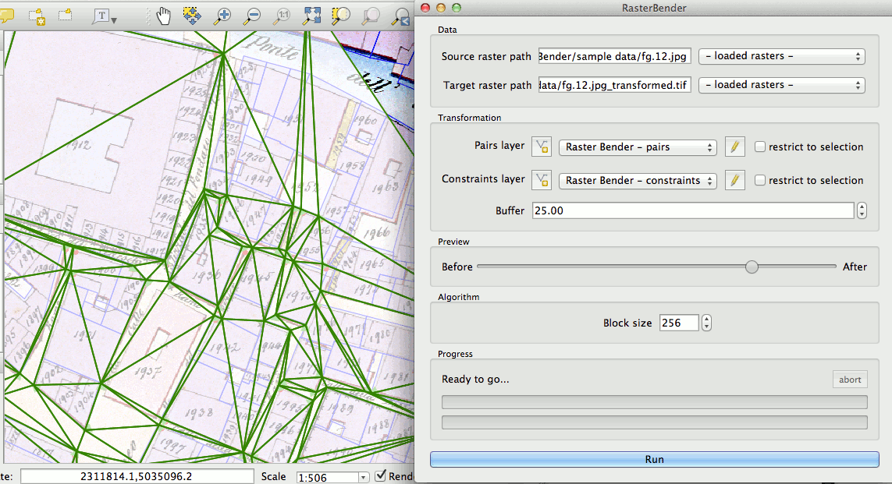

#    RasterBender   

RasterBender is an __EXPERIMENTAL__ QGIS Python plugin allowing to distort raster layers using pairs of points. This allows to match data that has complex non-uniform and non-linear deformations (historical maps, hand drawn sketches...).

__This plugin is not production ready at all__ and you should not use it beside for testing. See *limitations* below to see what to expect.

## How to use

Launch RasterBender from the plugins menu or from the plugin toolbar.

RasterBender works a bit like the georeferencer : you have to create pairs of points, the first one being the original location, and the second one being the target location.

To do so, RasterBender uses plain Linestring layers. Each pair is defined by the starting point and ending point of a Line in this layer.
You can either use one of your own Linestring layers, or use the  button from the RasterBender window.

You can also create a constraint layers, which will constrain the triangulation created by the plugin. This can be useful if you have some artifact generated by unwanted triangles. The constraints are line that should go from one starting point to another. Use the preview to see if the triangulation is affected as expected.

If you use RasterBender's layers, I recommend installing the "Save memory layer" plugin which will allow to save your work.

Once the layer to bend and the pairs layer are chosen, simply hit "run", wait a while (it can be quite long), and a new raster will be saved at the target path.

### How does the bending work

The first points of all pairs will be triangulated, and this triangulation will be mapped on the last points of all pairs. The raster layer will then be deformed by matching the triangulation.

The "buffer" parameters sets a buffer around the triangulation, so that the transformation ends more smoothely on the edges. Hold the "preview" button to see the size of the buffer.

Using this method will __INDUCE DEFORMATIONS__. You should __ONLY__ use it if your data is already deformed, and not to accomplish CRS transformations nor linear/affine transformations.

### The block size parameter

To avoid using too much memory, the target raster is divided into square blocks. The bigger the blocks, the more triangles must be analysed at the same time. The plugin will tell you how many triangles the trifinder must analyse. If this number is too high (more than 10 most of the time), try reducing the block size to gain speed.

## Feedback / Bugs / Contribute

Please report bugs and ideas on the issue tracker : https://github.com/olivierdalang/RasterBender/issues

Or send me some feedback at : olivier.dalang@gmail.com

## Limitations

RasterBender is in its early stages of developpement, and is currently tested only with GeoTIFF and RGB (3 channels) rasters. It is not expected to work with other file types.
The current raster bending algorithm is very sub-optimal and thus very slow.

## Version history

- 2014-11-17 - Version 0.0 : intial release

## Roadmap

### Not confirmed

- change algorithm to avoid the need of using a trifinder

## How it works (internally)

Here's how it works :

Preparing the mesh

1. Get a triangular mesh by doing a Delaunay triangulation of all original input points (starting points of the lines in the Raster Bender layer)
2. Adapt this mesh on the ending points of the lines
3. Get the convex hull of the points, offset it by some factor to have a smooth transition on the borders.

Doing the transformation

1. For each pixel of the target layer, find in which triangle it lies, and get it's barycentric coordinates in that triangle. Apply those barycentric coordinates to the source triangles, find the corresponding pixel, and copy it's compnonents.

